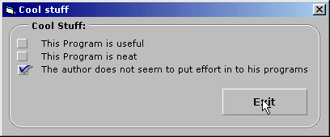



## Basic Stuff

### Description

This code will show some basics such as:

* how to create your own subs to decrease the ammount of coding in your project

* use the select case feature for manipulating arrays

* how to manipulate common controls such as lines and shapes to create dynamic controls such as a "cool button" (without OCX) and creating a rounded frame

Please rate this code and leave your comments
 
### More Info
 

             |
---                |---
**Submitted On**   |2000-08-17 02:54:06
**By**             |[Eric Sullivan](https://github.com/Planet-Source-Code/PSCIndex/blob/master/ByAuthor/eric-sullivan.md)
**Level**          |Beginner
**User Rating**    |4.6 (23 globes from 5 users)
**Compatibility**  |VB 6\.0
**Category**       |[Miscellaneous](https://github.com/Planet-Source-Code/PSCIndex/blob/master/ByCategory/miscellaneous__1-1.md)
**World**          |[Visual Basic](https://github.com/Planet-Source-Code/PSCIndex/blob/master/ByWorld/visual-basic.md)
**Archive File**   |[CODE\_UPLOAD90278172000\.zip](https://github.com/Planet-Source-Code/eric-sullivan-basic-stuff__1-10743/archive/master.zip)

### API Declarations

in code

